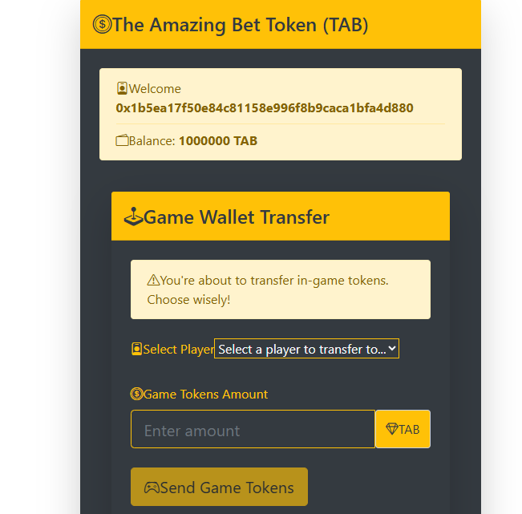

# 🎮 The Amazing Bet

> Lock your bet and compete with your friends in this decentralized betting platform.


A decentralized betting platform built on Ethereum where users can transfer there token to other crypto address 

## 🎯 Features

- **Secure Wallet Connection**: Easy integration with MetaMask and other Web3 wallets
- **Smart Contract Betting**: Trustless bet creation and resolution
- **Real-time Updates**: Live transaction tracking and bet status
- **User-friendly Interface**: Modern gaming-themed UI design

## 📸 Screenshots

### Connect Wallet Screen


### Transfer Tokens Screen


## 🚀 Quick Start

### Prerequisites
- Node.js >= 14.0.0
- MetaMask or any Web3 wallet
- Git

### Installation

1. Clone the repository:
```bash
git clone https://github.com/yourusername/amazing-bet.git
cd amazing-bet
```

2. Install dependencies:
```bash
npm install
```

3. Start the Hardhat network:
```bash
npx hardhat node
```

4. Deploy the smart contracts:
```bash
npx hardhat run scripts/deploy.js --network localhost
```

5. Launch the frontend:
```bash
cd frontend
npm install
npm start
```

Visit [http://localhost:3000](http://localhost:3000) to start betting!

## 🔧 Technology Stack

- **Frontend**: React.js, Web3.js
- **Smart Contracts**: Solidity
- **Development Environment**: Hardhat
- **Testing**: Chai, Mocha
- **Wallet Integration**: MetaMask

## 🧪 Testing

Run the test suite:

```bash
npx hardhat test
```

## Troubleshooting

- `Invalid nonce` errors: if you are seeing this error on the `npx hardhat node`
  console, try resetting your Metamask account. This will reset the account's
  transaction history and also the nonce. Open Metamask, click on your account
  followed by `Settings > Advanced > Clear activity tab data`.

## Setting up your editor

[Hardhat for Visual Studio Code](https://hardhat.org/hardhat-vscode) is the official Hardhat extension that adds advanced support for Solidity to VSCode. If you use Visual Studio Code, give it a try!

## Getting help and updates

If you need help with this project, or with Hardhat in general, please read [this guide](https://hardhat.org/hardhat-runner/docs/guides/getting-help) to learn where and how to get it.

For the latest news about Hardhat, [follow us on Twitter](https://twitter.com/HardhatHQ), and don't forget to star [our GitHub repository](https://github.com/NomicFoundation/hardhat)!

## 🤝 Contributing

Contributions are welcome! Please feel free to submit a Pull Request.

## 📄 License

This project is licensed under the MIT License - see the [LICENSE](LICENSE) file for details.

## 🙏 Acknowledgements
- Professor Andrew for guiding with the project
- Hardhat Team for the amazing development environment
- OpenZeppelin for secure smart contract components
- The Ethereum community for continuous support

---
Built with ❤️ by Neepurna 
